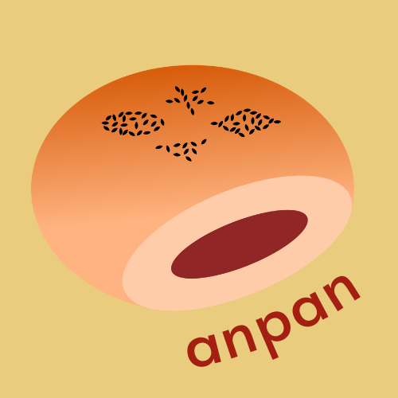

<!-- <div align="center">
  
</div> -->


<h1 align="center">anpan</h1>

<div align="center">A Redis OM for Bun</div>
<br>
<div align="center"><a href="https://breadisbuns.github.io/">Visit our Website</a></div>
<br>
<div align="center">Checkout our library:</div>
<div align="center">
<a href="https://www.npmjs.com/package/@breadisbuns/anpan"></a>
</div>
<br>
<div align="center">Read our Medium Launch Article:</div>
<div align="center">
<a href=""></a>
</div>
<br>
<div align="center">


</div>
<br>

## Table of Contents

1. [Description](#description)
2. [Getting Started](#get-started)
3. [Query](#query)
4. [Additional Methods](#additional-methods)
5. [Open Source Information](#open-source-information)
4. [Authors](#authors)
5. [License](#license)

## <a name='description'></a> Description

<strong>anpan</strong> is a lightweight Redis Object Mapper (OM) library built for the Bun runtime. Bun is an up-and-coming runtime environment for Javascript and Typescript that replaces Node.js. Bun’s v1.0 was released on September 8th, 2023, and has since demonstrated that they are 4x faster than Node.js and 2x faster than Deno. Since their release, many developers, like those working with a Redis database, are seeking to run their code in Bun for its speed and efficiency. Unfortunately, no Redis-specific library currently runs in the Bun runtime environment. anpan is a Redis OM that bridges the gap for developers working in Bun with a Redis database. anpan works to abstract away hard-to-understand and write syntax, that, when paired with the <strong><a href="https://breadisbuns.github.io/">anpan webpage</a></strong>, helps even a new user learn Redis right away. anpan brings the familiarity of other databases and libraries, like MongoDB and Mongoose, allowing other NoSQL database users easy access and navigation. 


## <a name='get-started'></a> Getting Started
Be sure that you have the [Bun](https://bun.sh/docs/installation) runtime installed and configured.

### Quick Start
In your application, install the package from the NPM [module](https://www.npmjs.com/package/@breadisbuns/anpan).
```bash
bun i @breadisbuns/anpan
```
Next, require in the anpan module into your codebase.
```typescript
const { Schema, Repository } = require('@breadisbuns/anpan');
```

### Connect to your Database
Open a connection by requiring in createClient from Redis with the Redis cloud link found in your <a href="https://redis.com/">Redis dashboard</a>, and using the connect method from Redis.
```typescript
const { createClient } = require('redis');

const { client } = createClient({
  password: 'YOUR PASSWORD HERE',
  socket: {
    host: 'LINK TO CLOUD',
    port: 12179,
  },
});

await client.connect().then(console.log('Connected to Redis'));
```

### Define Your Schema
Now, you can define your schema with the Schema method as shown below or by utilizing the schema generator on the <a href='https://breadisbuns.github.io/'>anpan webpage</a>: 
```typescript
const bakerySchema = new Schema('bakery', {
  name: { type: 'string', isRequired: true },
  owner: { type: 'string', isRequired: true },
  dateCreated: { type: 'date' },
  bakeryNum: { type: 'number' },
  location: { type: 'point' },
  bunsOffered: { type: 'string[]' },
});
```
Valid Datatypes include:
- boolean
- date
- number
- number[]
- point
- string
- string[]
- text

### Create Your Repository
Set up a repository by invoking the Respository method with your schema name and client:
```typescript
const theBakeries = new Repository(bakerySchema, client);
```

### Add to Your Repository
You can now add to the repository by creating entities with your data as outlined in your schema:
```typescript
const anpanBun = {
  name: 'Buns Unlimited',
  owner: 'May',
  dateCreated: new Date(2023, 1, 14),
  bakeryNum: 1,
  location: { longitude: 1, latitude: 1 },
  bunsOffered: ['Hotcross', 'Hotdog', 'Steamed'],
};

const mayBakery = await theBakeries.save(anpanBun); //adds entity to Redis database
```

### Make a Query
Now, you can search and find items in your model. For example, if you wanted to look at the buns offered at May's Buns Unlimited bakery, you can fetch by ULID:
```typescript
//---Targeting a ULID---
const mayULID = mayBakery.entityKeyName;
console.log(mayULID); //displays ULID in your console to fetch

//---Fetching w/ULID---
let fetchMay = await theBakeries.fetch(mayULID);
console.log(fetchMay); //will log fetched mayBakery
```
Congratulations! You have successfully imported anpan, connected to Redis client, created a schema and a repository, added an entitiy to your Redis database, and fetched May's bakery. Explore the rest of the README.md for more detailed instructions on how to use anpan.

## <a name='query'></a> Query
All queries in anpan are performed using repositories. All query methods are listed below:
- getAllEntities
```typescript
const allBakeries = await theBakeries.getAllEntities();
console.log(allBakeries); //Will log all stored bakeries!
```
- getByString
```typescript
const findString = await theBakeries.getByString('Kevin');
console.log(findString); //Will log all bakeries containing queried string
```
- getByNumber
```typescript
const findNumber = await theBakeries.getByNumber(1);
console.log(findNumber); //Will log all bakeries containing queried number
```

## <a name='additional-methods'></a> Additional Methods
Additional features and methods include:
- update with save()
```typescript
//---Update with save()---
fetchMay.bunsOffered.push('Melonpan');
fetchMay = await theBakeries.save(fetchMay);
console.log(fetchMay); //Will log with additional bun offered
```
- remove with ULID
```typescript
//---Remove w/ULID---
const dillonULID = dillonBakery.entityKeyName;
const deleteDillon = await theBakeries.remove(dillonULID);
console.log(deleteDillon); //Will log undefined
```
- expire with ULID
```typescript
//---Expire w/ULID---
const kellsyULID = kellsyBakery.entityKeyName;
const expireKellsy = await theBakeries.expire(kellsyULID, 10); //Will show countdown in RedisInsight, logs undefined after expiration
```

## <a name='open-source-information'></a> Open Source Information
If you would like to contribute to our product, let us know! Below are features and methods we would have liked to implement in our library. If you would like to propose a new feature or method, send us a message.

### Contribution Guidelines
To contribute, fork and clone our repository. Once set up, any changes will need to be approved via Pull Requests. We ask that you include as much information and documentation for any changes made when you create a PR.

### Running the library tests in dev mode
Once cloned, run the command:
```bash
bun test
```

### Features and Methods:
| Feature                                                                               | Status    |
|---------------------------------------------------------------------------------------|-----------|
| Point search functionality     | 🙏🏻        |
| Pagination search functionality    | 🙏🏻        |
| Sorting functionality    | 🙏🏻        |

- ✅ = Ready to use
- ⏳ = In progress
- 🙏🏻 = Looking for contributors

## <a name='authors'></a> Authors
- ### May Wilcher
  <a href="https://github.com/rehcliw"></a>
  <a href="https://www.linkedin.com/in/may-wilcher/"></a>
- ### Kellsy Nava-López
  <a href="https://github.com/kelsIam"></a>
  <a href="https://www.linkedin.com/in/kellsy-nava-l%C3%B3pez/"></a>
- ### Dillon Hale
  <a href="https://github.com/HailsD"></a>
  <a href="https://www.linkedin.com/in/dillon-hale/"></a>
- ### Kevin Murphy
  <a href="https://github.com/murph212"></a>
  <a href="https://www.linkedin.com/in/kevin-murphy-5173701b/"></a>

## <a name='license'></a> License
This product is licensed under the MIT License - see the LICENSE file for details.

This is an open-source product.

This product is accelerated by <a href="https://opensourcelabs.io/">OS Labs.</a>
